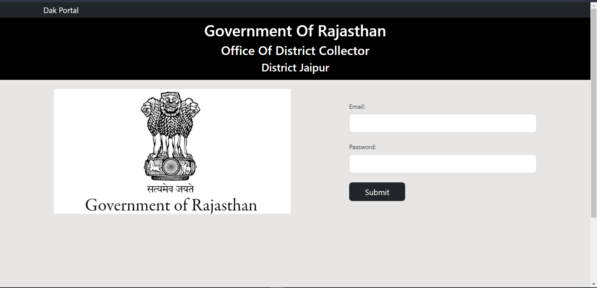
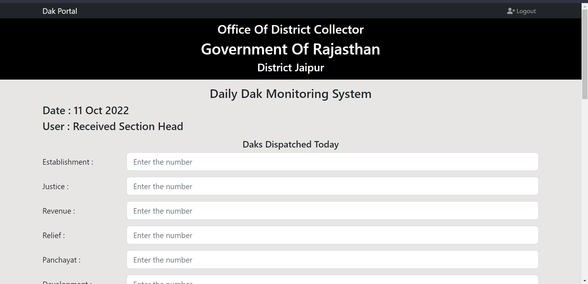
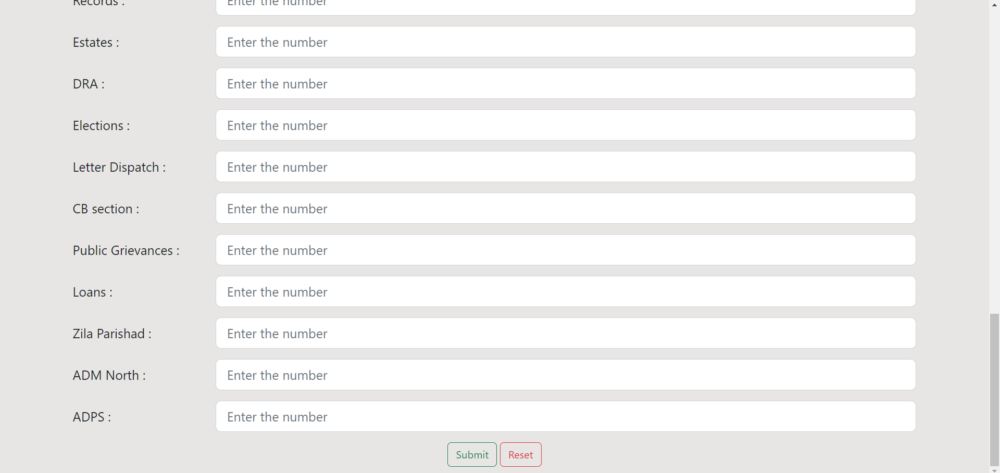
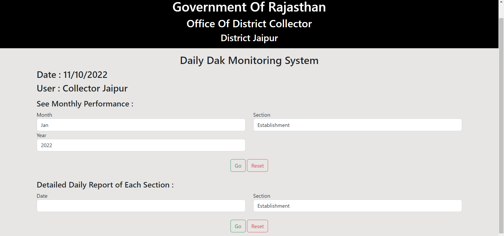
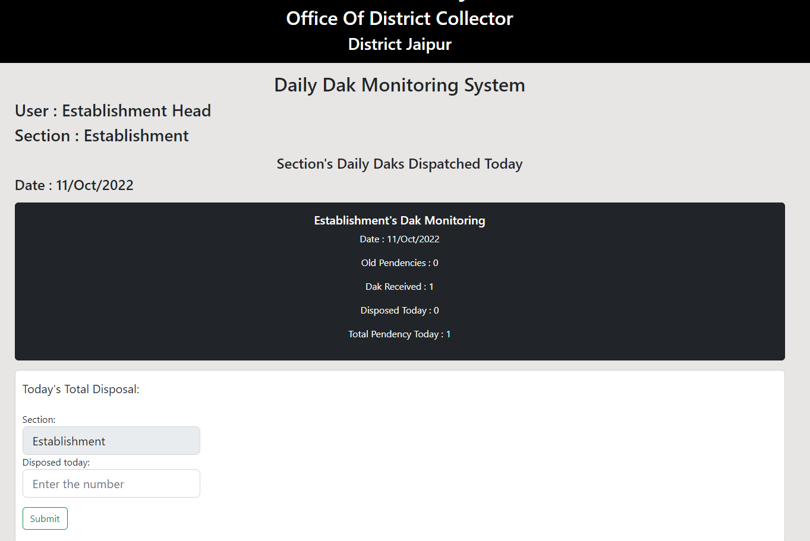

# DAK Management System
**Dak Management System (DMS)** is developed with an aim to streamline the Dak Receivng section.<br>
The portal has 3 kinds of users-
1. **Collector-Jaipur** : Can see reports of various kinds such as Monthly report across all sections, daily report across sections and similar report of individual sections. Ranking system is also available with download facility in Excel.
2. **Received Section**: The OIC of section can ONLY insert number of daks sent to each section.
3. **OIC Section**: Can upload number of Daks disposed on that particular day. Cant change number of letters received.

## Project Screenshots






<hr>
<h3> Technologies used </h3><br>
-Html, CSS, Javascript, Bootstrap used for frontend<br>
-Nodejs for backend<br>
-Firebase for authentication and database
<hr>
<h3> Project Installation Instructions</h3>

Dak Management System requires [Node.js](https://nodejs.org/) v16.17.1 to run.

Install the dependencies and devDependencies and start the server


```sh
cd DAK-System-Deployment

npm install
```

To run the server 

```sh
node index.js
```
> Note: `Credentials of this site are with the contributors of this project.`

Verify the deployment by navigating to your server address in your preferred browser.
```sh
http://localhost:3000/
```
<hr>
<b>Contributors<b> - <i>[Abhigyan Jha](https://github.com/AJSteel01) , [Sahil Patani](https://github.com/sahilpatani1012)<i>
